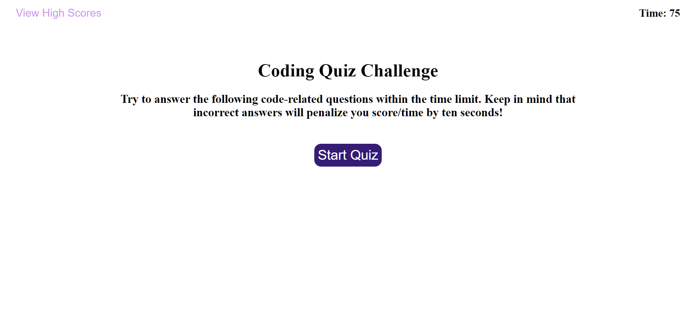

# code-quiz

https://tremigi.github.io/code-quiz/

The code quiz is a school project created by Taylor Remigi. It features dynamically generated content utilizing the DOM to display an interactive coding quiz. Users can select answers in a timed challenge which will display a score upon completion. High scores are saved locally and can be viewed or deleted by the user at any time.

Please see repository issues page for future features, refactors, and bug fixes.

## Installation

No installation required.

HTML, CSS including media queries, JavaScript, and various web API's were used to create this application.

## Contributing
Created by Taylor Remigi
